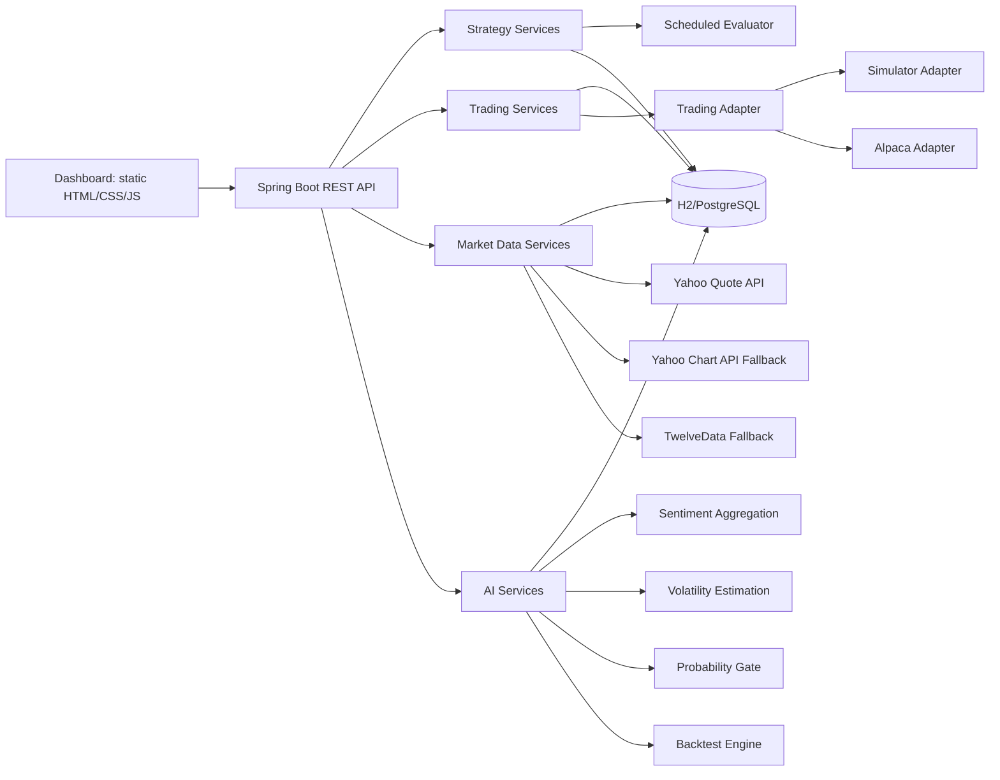

# PaperStock Unified Trading Platform

PaperStock is a paper-trading and strategy automation application with AI-assisted decisioning.

It helps you:
- search symbols and monitor live prices
- configure per-symbol trading strategies
- manage holdings and P&L
- automate trade evaluation and execution
- use AI sentiment + volatility-aware probability gates
- backtest AI-enabled vs rule-only behavior

## Why This Project
Manual strategy execution is slow, inconsistent, and hard to evaluate. PaperStock combines:
- deterministic trading rules
- real-time market data integration with provider fallback
- explainable AI overlays
- one-click backtesting for safer iteration

## Core Features
- Trading mode support:
  - simulator mode for safe paper execution
  - alpaca mode for broker-backed APIs
- Strategy lifecycle:
  - create, edit, pause/resume, delete per-symbol strategy
- Market data:
  - provider-backed quote fetch
  - stale quote detection and safeguards
  - symbol search
- Holdings and reporting:
  - manual position add/update/delete
  - unrealized P&L with live price
  - per-symbol buy/sell aggregate report
- AI insights:
  - current sentiment score per symbol
  - live buy/sell decision probabilities
  - dynamic thresholding based on volatility
  - backtesting engine

## Architecture Overview

## AI Architecture Showcase
The AI layer augments strategy rules instead of replacing them.

### 1) Sentiment Ingestion and Scoring
- Input signals are persisted in sentiment history.
- Scores are aggregated by symbol over a configurable lookback window.
- Output: normalized sentiment score used as a directional feature.

### 2) Volatility-Aware Threshold Adjustment
- Recent snapshot history is used to estimate short-window volatility.
- Base buy/sell thresholds are adjusted dynamically using a volatility factor.
- High-volatility periods require stronger confirmation before execution.

### 3) Probability-Based Trade Gating
- AI computes buy/sell probabilities from rule context + market + sentiment signals.
- A configurable probability threshold determines whether a rule-triggered trade is allowed.
- Output is visible in dashboard for explainability.

### 4) Side-by-Side Backtesting
- Runs rule-only and AI-enabled simulations on the same symbol/time points.
- Compares outcomes like ending cash/equity and trade behavior.
- Enables iterative tuning before enabling automation in active workflows.

## Technology Stack
- Language and build:
  - Java 25
  - Gradle (wrapper)
- Backend:
  - Spring Boot 4.0.0
  - Spring Web MVC + WebFlux client
  - Spring Data JPA
  - Spring Validation
  - Spring Cache + Caffeine
  - Actuator
- Data and schema:
  - H2 (default)
  - PostgreSQL (profile-based)
  - Flyway migrations
- Reliability:
  - Resilience4j retry and circuit breaker
- API and docs:
  - OpenAPI (openapi.yaml)
  - Swagger UI (springdoc)
- UI:
  - static HTML/CSS/JavaScript dashboard
  - Chart.js based charting
- Tests:
  - JUnit 5
  - Spring Boot Test
  - Reactor Test
  - Testcontainers
  - WireMock

## Project Structure
- src/main/java/com/aigrama/papermoney
  - controllers, services, adapters, entities, repositories
- src/main/resources
  - application configuration, Flyway migrations, static dashboard
- src/test/java/com/aigrama/papermoney
  - unit and integration tests
- docs
  - technical and product documentation
- infra/docker-compose.yml
  - local infra bootstrap
- openapi.yaml
  - API contract

## Quick Start
### Prerequisites
- JDK 25
- Internet access for provider APIs

### Run Locally
1. Build and test
   - ./gradlew clean test --console=plain
2. Start the app
   - ./gradlew bootRun
3. Open
   - Dashboard: http://localhost:8080/
   - Swagger UI: http://localhost:8080/swagger-ui.html
   - OpenAPI JSON: http://localhost:8080/v3/api-docs

## Configuration
Main config file:
- src/main/resources/application.yml

Profile override (PostgreSQL):
- src/main/resources/application-postgres.yml

Important properties:
- paperstock.mode
- paperstock.market-data.provider
- paperstock.market-data.max-stale-seconds
- paperstock.strategy.eval-ms
- paperstock.ai.enabled
- paperstock.ai.sentiment.lookback-hours
- paperstock.ai.volatility.window
- paperstock.ai.volatility.factor
- paperstock.ai.probability.threshold

Environment variables:
- ALPACA_BASE_URL
- ALPACA_DATA_BASE_URL
- ALPACA_API_KEY
- ALPACA_API_SECRET
- MARKET_DATA_PROVIDER
- MARKET_DATA_MAX_STALE_SECONDS
- YAHOO_QUOTE_BASE_URL
- YAHOO_CHART_BASE_URL
- YAHOO_SEARCH_BASE_URL
- TWELVEDATA_BASE_URL
- TWELVEDATA_API_KEY
- PAPERSTOCK_AI_ENABLED
- PAPERSTOCK_AI_SENTIMENT_LOOKBACK_HOURS
- PAPERSTOCK_AI_VOLATILITY_WINDOW
- PAPERSTOCK_AI_VOLATILITY_FACTOR
- PAPERSTOCK_AI_PROBABILITY_THRESHOLD

## API Areas
- account: /api/account
- trading: /api/trade/*
- market: /api/market/*
- strategies: /api/strategies/*
- AI: /api/ai/*

## Deployment
### Docker
1. Build jar
   - ./gradlew bootJar
2. Build image
   - docker build -t paperstock:local .
3. Run
   - docker run --rm -p 8080:8080 paperstock:local

Note:
- The current Docker runtime image should match Java 25 for strict runtime parity.

## Known Provider Constraints
- Yahoo can return rate limits (429) in burst scenarios.
- TwelveData requires a valid API key for reliable fallback.
- Live price availability depends on upstream provider health and limits.

## Documentation
- Technical details: docs/technical-details.md
- Application usage: docs/application-overview.md

## Suggested Roadmap
- add authentication and role-based access
- add provider tagging on displayed quotes
- add AI confidence trend chart
- add report export (CSV)
