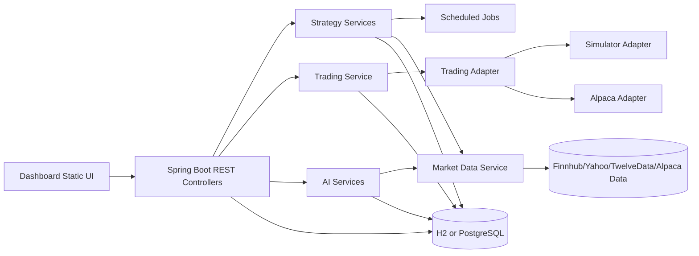

# PaperStock Technical Details

## Purpose
This document is for developers and maintainers of PaperStock Unified Trading Platform. It explains architecture, configuration, setup, and deployment.

## Technology Stack
- Java 25 (Gradle toolchain)
- Gradle with Spring Boot 4.0.0
- Spring Web MVC + WebFlux client
- Spring Data JPA
- H2 (default local runtime)
- PostgreSQL (profile-based runtime)
- Flyway (schema migrations)
- Caffeine cache
- Resilience4j retry/circuit-breaker
- OpenAPI/Swagger UI (springdoc)

## Project Structure
- src/main/java/com/aigrama/papermoney
: application code
- src/main/resources
: configuration, Flyway migrations, static dashboard UI
- src/test/java/com/aigrama/papermoney
: integration/unit tests
- docs
: phase docs and architecture notes
- infra/docker-compose.yml
: local infrastructure bootstrap
- openapi.yaml
: API contract

## High-Level Architecture

## Core Modules
- Trading Module
: order placement, cancellation, positions, account snapshot
- Strategy Module
: per-symbol config, pause/resume, scheduled execution, activity logging, chart series
- Market Data Module
: quote retrieval, symbol search, persisted snapshots, stale quote protection
- AI Module
: sentiment ingestion/aggregation, volatility-aware threshold adjustment, probability gating, backtesting
- Dashboard Module
: static UI with forms, reports, activity, chart, holdings, AI insights

## Data Model Overview
Main tables (from Flyway and JPA entities):
- orders
- trades
- positions
- market_snapshots
- strategy_configs
- strategy_executions
- sentiment_signals

## Runtime Modes
- simulator
: local matching engine, local persistence, paper execution
- alpaca
: external broker API mode (requires credentials)

Mode is configured through:
- paperstock.mode

## Configuration Reference
Primary file:
- src/main/resources/application.yml

Profile override:
- src/main/resources/application-postgres.yml

### Important Keys
- paperstock.mode
- paperstock.symbols
- paperstock.market-data.provider
- paperstock.market-data.max-stale-seconds
- paperstock.market-data.finnhub.base-url
- paperstock.market-data.finnhub.api-key
- paperstock.market-data.yahoo.quote-base-url
- paperstock.market-data.yahoo.chart-base-url
- paperstock.market-data.yahoo.search-base-url
- paperstock.market-data.twelvedata.base-url
- paperstock.market-data.twelvedata.api-key
- paperstock.strategy.enabled
- paperstock.strategy.eval-ms
- paperstock.ai.enabled
- paperstock.ai.sentiment.lookback-hours
- paperstock.ai.volatility.window
- paperstock.ai.volatility.factor
- paperstock.ai.probability.threshold

### Common Environment Variables
- ALPACA_BASE_URL
- ALPACA_DATA_BASE_URL
- ALPACA_API_KEY
- ALPACA_API_SECRET
- MARKET_DATA_PROVIDER
- MARKET_DATA_MAX_STALE_SECONDS
- YAHOO_QUOTE_BASE_URL
- YAHOO_CHART_BASE_URL
- YAHOO_SEARCH_BASE_URL
- TWELVEDATA_BASE_URL
- TWELVEDATA_API_KEY
- PAPERSTOCK_AI_ENABLED
- PAPERSTOCK_AI_SENTIMENT_LOOKBACK_HOURS
- PAPERSTOCK_AI_VOLATILITY_WINDOW
- PAPERSTOCK_AI_VOLATILITY_FACTOR
- PAPERSTOCK_AI_PROBABILITY_THRESHOLD

## Local Setup
### Prerequisites
- JDK 25 installed
- Network access for quote providers (Yahoo/TwelveData/Alpaca)

### Build and Test
1. ./gradlew clean test --console=plain
2. ./gradlew bootRun

### Open UI and API Docs
- Dashboard: http://localhost:8080/
- Swagger UI: http://localhost:8080/swagger-ui.html
- OpenAPI JSON: http://localhost:8080/v3/api-docs

## PostgreSQL Setup
1. Start PostgreSQL and create database/user matching profile or override env vars.
2. Run app with postgres profile:
- ./gradlew bootRun -Dspring.profiles.active=postgres

Note:
- application-postgres.yml sets hibernate ddl-auto to none.
- Ensure Flyway migrations are enabled for schema bootstrap.

## Docker and Deployment
### Current Dockerfile
- Dockerfile copies build/libs/paperstock-app.jar and runs java -jar.

### Build and Run
1. ./gradlew bootJar
2. docker build -t paperstock:local .
3. docker run --rm -p 8080:8080 paperstock:local

### Important Runtime Note
- Build toolchain is Java 25 while Dockerfile currently uses eclipse-temurin:21-jre.
- For production parity, use a Java 25 runtime image in Docker.

## Scheduled Jobs
- Market snapshot polling job (paperstock.market-data.poll-ms)
- Strategy execution job (paperstock.strategy.eval-ms)

## AI Workflow Details
1. Sentiment signals are ingested from news/social text.
2. Sentiment score is aggregated per symbol over lookback window.
3. Volatility is estimated from recent market snapshots.
4. Dynamic thresholds are computed from base strategy thresholds.
5. Buy/sell probabilities are generated and gated by threshold.
6. Backtest compares AI-enabled logic with rule-only logic.

## API Domains
- Trading APIs: /api/trade/*
- Account API: /api/account
- Market APIs: /api/market/*
- Strategy APIs: /api/strategies/*
- AI APIs: /api/ai/*

## Troubleshooting
### bootRun command fails
- Use ./gradlew bootRun (wrapper) instead of system gradle.
- Validate JDK version with java -version.

### Live price unavailable or missing
- Yahoo endpoints may return 429.
- Provide valid TWELVEDATA_API_KEY fallback.
- Verify provider config in application.yml.

### Backtest errors for low data
- Backtest requires at least 2 snapshots for selected symbol.
- Trigger quote refresh/search to create snapshot history.

### Strategy save failures
- Duplicate symbol create requests are auto-updated in UI.
- Backend returns clean 400 with validation details.

## Testing Strategy
- Unit tests: simulator matching and adapter mappings.
- Integration tests: flow tests and provider parsing/fallback behavior.

Run:
- ./gradlew test --console=plain

## Security and Ops Recommendations
- Do not commit provider secrets.
- Inject secrets via environment variables.
- Keep actuator exposure minimal in production.
- Add authentication/authorization before public deployment.
- Add centralized logging and metrics dashboards for operations.
